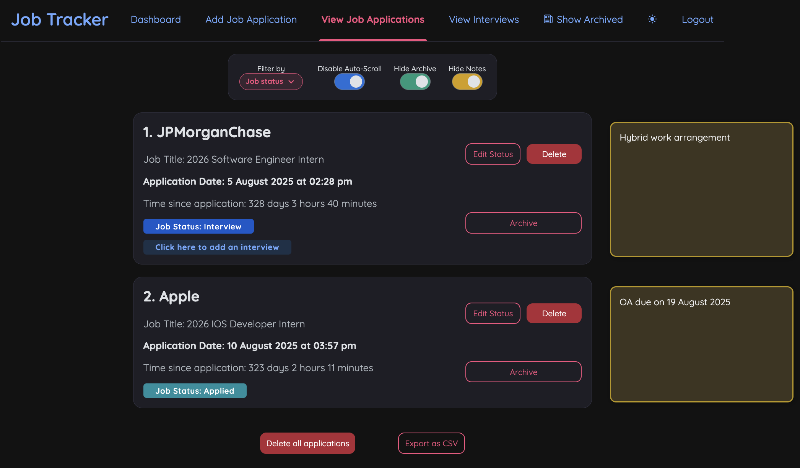

# Job Tracker

## Overview
Job Tracker is a full-stack PERN application for managing job applications and interviews. It supports status tracking, interview management, archiving, CSV export, user preferences, and secure authentication.

- Site: https://jobtracker.weihungloh.com/
- User Guide: https://jobtracker.weihungloh.com/user-guide/

## Tech Stack
- Frontend: React, TypeScript, Vite, Material UI
- Backend: Node.js, Express, TypeScript
- Database: PostgreSQL
- Deployment: Netlify, Render, GitHub Actions, Docker

## Key Features
- Manage job applications with status, dates, locations, posting URLs, and notes
- Track interviews linked to job applications
- Add upcoming interviews to Google Calendar, Apple Calendar, and Outlook
- Archive and restore applications and interviews
- Export interview data to CSV
- Save user display preferences
- JWT authentication with access and refresh tokens stored in Secure, HttpOnly, SameSite cookies
- bcrypt password hashing, rate limiting, Helmet, CORS, and user-scoped database queries
