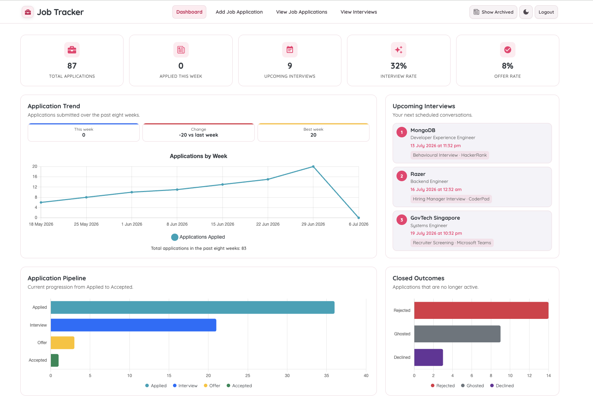

# Job Tracker

## Overview

Job Tracker is a full-stack PERN application for managing job applications and interviews. It supports status tracking, interview management, archiving, CSV export, user preferences, and secure authentication.

-   Site: https://jobtracker.weihungloh.com/
-   User Guide: https://jobtracker.weihungloh.com/user-guide/
-   Explore Demo: https://jobtracker.weihungloh.com/demo/application/view

## Tech Stack

-   Frontend: React, TypeScript, Vite, Material UI
-   Backend: Node.js, Express, TypeScript
-   Database: PostgreSQL
-   Deployment: Netlify, Render, GitHub Actions, Docker

## Key Features

-   Manage job applications with status, dates, locations, posting URLs, and notes
-   Explore a fully interactive frontend demo without creating an account
-   Review application trends, pipeline stages, closed outcomes, conversion rates, and upcoming interviews
-   Prioritize up to six follow-ups with a read-only Needs Attention action center using clear 7-day and 21-day signals
-   Switch between list and Kanban board views with drag-and-drop status updates
-   Track interviews linked to job applications
-   Add upcoming interviews to Google Calendar, Apple Calendar, and Outlook
-   Archive and restore applications and interviews
-   Export application and interview data to CSV
-   Save user display preferences
-   JWT authentication with access and refresh tokens stored in Secure, HttpOnly, SameSite cookies
-   bcrypt password hashing, rate limiting, Helmet, CORS, and user-scoped database queries
