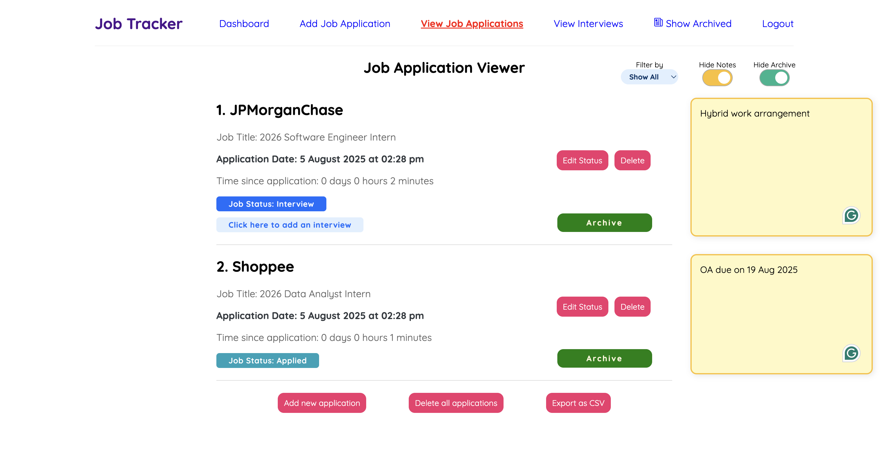

# Job Tracker

## Overview

Job Tracker is a full-stack web application built with the PERN stack (PostgreSQL, Express, React, Node.js) designed to help users efficiently manage their job applications and interviews. It provides intuitive status tracking, archiving, and linked data handling to keep your job search organized.

## Features

- Add, update, and delete job applications with relevant details (company, position, status, dates, etc.)  
- Track interviews linked to specific job applications  
- Archive and unarchive job applications and related interviews for better data management  
- Status updates with dropdowns and automatic UI feedback  
- Data integrity ensured through cascading deletes and linked data management  
- Responsive, user-friendly interface built with React  
- Secure authentication with JWT and password hashing  
- CI/CD workflows automate testing, linting, and deployment

## User Guide

For detailed usage instructions, see the User Guide <a href="https://jobtracker-whloh.netlify.app/userguide" target="_blank">here</a>

## Live Demo

Check out the live app <a href="https://jobtracker-whloh.netlify.app/" target="_blank">here</a>
